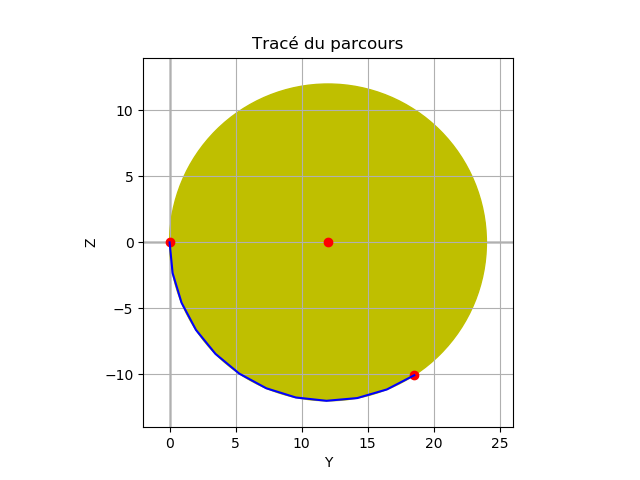

# Challenge Neofarm  
## Partie code du challenge de Neofarm  
	  
			
**Que fait le programme?**  
NeoFarm a besoin de réaliser des mouvements circulaires avec son robot maraicher. Le contrôleur du robot reçoit en entrée la valeur de l'angle de la section circulaire à parcourir, le rayon du cercle (qui peut être négatif!), le plan d'évolution du robot ainsi que l'axe sur lequel se trouve le centre du cercle, et enfin le nombre de points qui discréditent la section circulaire.  

A partir de ces données d'entrée, l'algorithme retourne en format .json la liste des coordonnées (x, y, z) des points par lequel le robot passera pour décrire son mouvement circulaire.  

Ci-dessous un aperçu de ce que renvoie le programme pour les paramètres d'entrée suivants:  
Plan='YZ'  
Axe='Y'  
r=-15  
θ=90  
sens=-1  
NbPoints=10  

## Problèmes potentiellement rencontrés lors de l'éxécution du code  
Ce code fait appel aux bilbliothèques numpy et matplotlib pour le rendu visuel.
Pour les installer:
https://matplotlib.org/3.1.1/users/installing.html

Pour améliorer le confort de lecture, j'utilise les symboles grecs au lieu de les écrire en toute lettre (θ au lieu de theta). Sur les anciennes versions de python et dans d'autres langages, cela peut poser problème. Un rechercher remplacer est alors la meilleure solution ;)  
